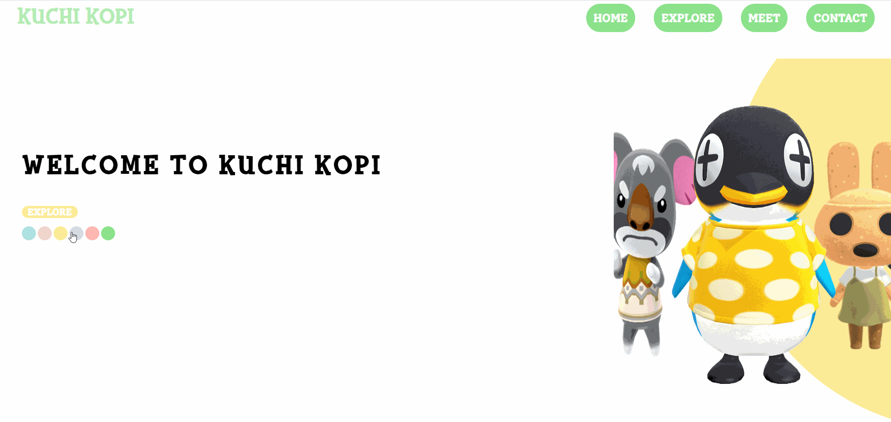
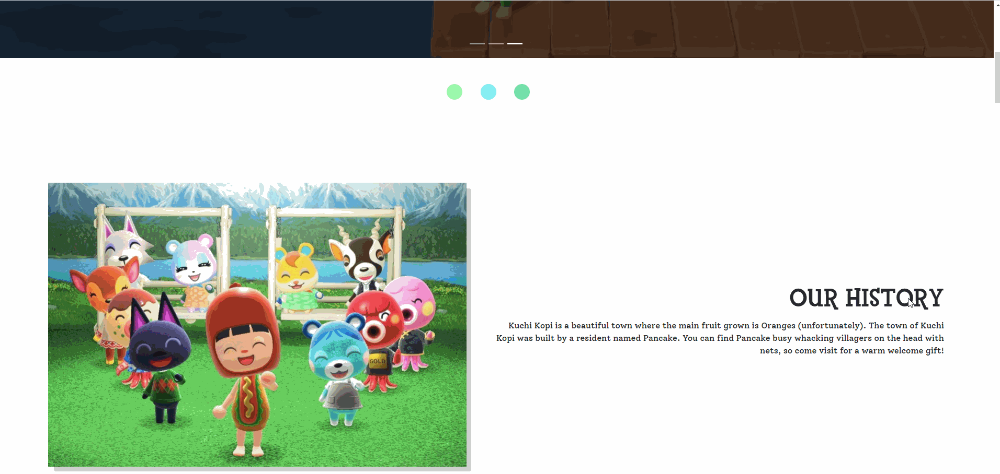
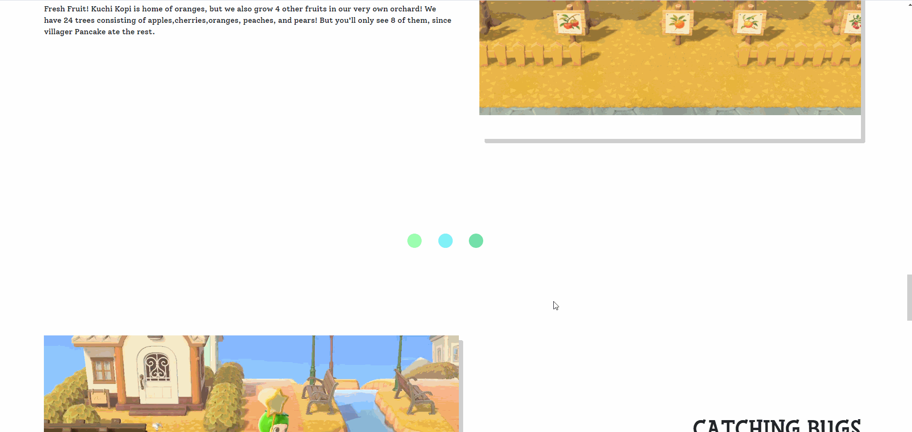
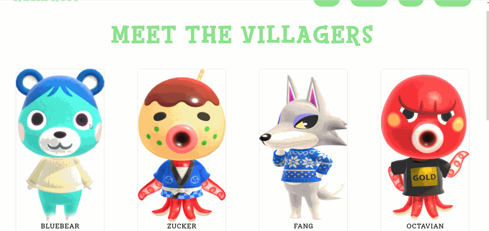
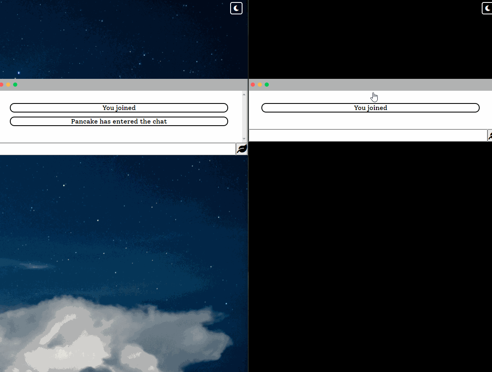

# KuchiKopi Island 
https://kuchikopi.netlify.app/

This was a portfolio project done for the class, CS290 - Web Development,  at OSU. This project is a travel website for my island, Kuchi Kopi, in the video game, Animal Crossing New Horizon.

## Tech Stack
HTML, CSS , Javascript , BootStrap , Node.Js , Socket.IO , jQuery

## Walkthrough

- Showcasing landing page featuring touch slider along with color picker

- Showcasing Things To Do Section and Image Sliders on Explore Tab

- Showcasing Descriptions of Island Activities and Areas of Interest on Explore Tab

- Showcasing Villager Info Cards on Meet Tab

- Showcasing Chat Application Demo

## Features

The following features are implemented:
* [X] Responsive Navigation Bar with custom CSS hamburger menu
* [X] Color Dots on Landing Page where user can change color of font/backgrounds
* [X] Swiper.JS Touch Slider where users can swipe to shift through villagers
* [X] BootStrap Carousel and BootStrap Grid Layouts
* [X] Owl Carousel implemented with Jquery
* [X] Simple Contact Form 
* [X] Cards that introduce villagers with Hover Effect
* [X] Chat Room where users can chat with other visitors! (Reference from WebDevSimplified's tutorial and official Socket.IO website) 
* [X] Chat application implements Dark/Light Mode with changing icon/wallpaper

## HOW TO RUN THE CHAT APPLICATION

Make sure that Node.JS is installed. In the terminal,
* Enter "npm i" or "npm install"
* Next "npm run devStart"

## Photo Credits
* Photos used in this project are taken from my personal island in the video game, Animal Crossing New Horizons, and are not used for commercial use. 
* Photos used on the landing page are taken from StickPNG.com where these photos are used only for personal use NOT commerical use.
* Photos used on the explore tab , Things To Do Section, is taken from AnimalCrossing.fandom.com and are used for personal use NOT commercial use. 
